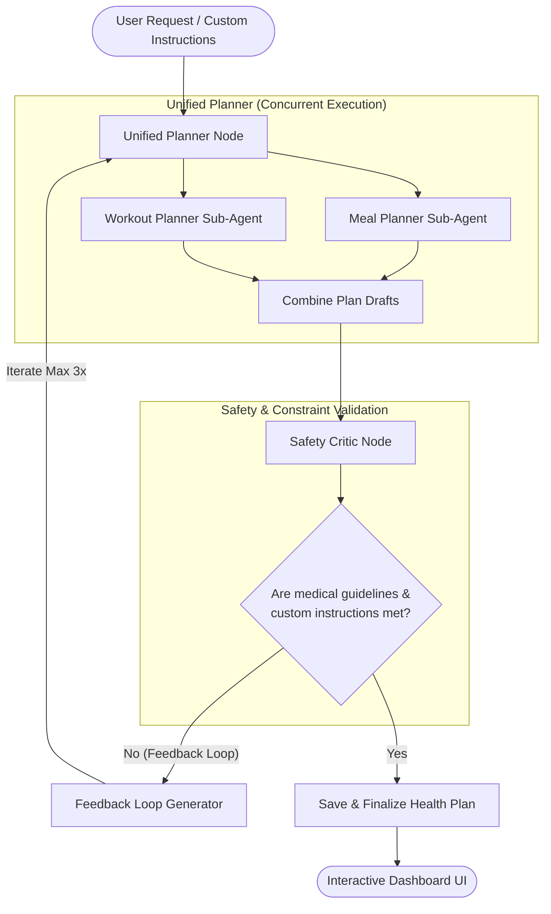

# 🌱 SmartSprout AI Health Companion

SmartSprout is an advanced, personalized health companion that helps users track their diet, log workouts, and generate safe, tailored daily health plans (meals and workouts) using a state-of-the-art **multi-agent AI workflow**.

---

## 🤖 Agentic Architecture

SmartSprout utilizes a robust, feedback-driven **LangGraph multi-agent flow** powered by Google Gemini to construct daily health plans. Rather than relying on a single AI prompt, plans are built, audited, and refined collaboratively by specialized agentic nodes.



### How the Agents Work
1. **Unified Planner Node**: When a plan request is received (optionally containing custom user instructions, dietary preferences, or medical history), the unified planner triggers two planning agents concurrently:
   * **Meal Planner Agent**: Drafts a daily recipe guide including calorie, protein, fat, and carb calculations suited to user profiles.
   * **Workout Planner Agent**: Customizes an exercise plan based on fitness level, equipment availability, and target goals.
2. **Safety Critic Node**: The combined plan is automatically passed to the Safety Critic agent. The critic audits the plan against:
   * Any food allergies or medical flags logged in the user profile.
   * Feasibility, physical safety, and nutritional balance.
   * Specific custom instructions provided by the user (e.g., *"Make it vegan"* or *"Focus on bodyweight exercises"*).
3. **The Feedback Loop**: If the Safety Critic identifies an issue, it generates corrective feedback and routes the plan back to the **Unified Planner** to regenerate. This loop repeats up to **3 times** until the plan meets all safety constraints, preventing hallucinated or unsafe guidelines.

---

## ⚡ Key Features

* **Multi-Agent Health Planner**: Leverages LangGraph to generate safe, cross-validated daily diet and exercise plans.
* **Smart Food Vision**: Upload photos of meals to parse and log nutritional information (calories, macronutrients) automatically.
* **Interactive AI Chat Coach**: Real-time advice, meal suggestions, and conversational support with saved chat histories.
* **Nutrient & Activity Trackers**: Integrated logging for water intake, steps, customized foods, and exercises.
* **Dynamic Dashboard Analytics**: Modern graphs showing weekly/monthly trends for weight, steps, calories, and hydration.

---

## 🛠️ Technology Stack

* **Frontend**: React.js, Vite, Vanilla CSS (Premium HSL tokens, glassmorphism, responsive grid layouts).
* **Backend**: FastAPI (Python), SQLAlchemy, Alembic (Database migrations).
* **Database**: SQLite (Highly optimized query architecture).
* **AI Orchestration**: LangGraph, LangChain, Google Generative AI (Gemini Pro/Flash & Gemini Vision).

---

## 🚀 Getting Started

### 1. Prerequisites
Ensure you have the following installed on your machine:
* Python 3.10+
* Node.js 18+

### 2. Backend Setup
1. Navigate to the project root folder.
2. Create and activate a virtual environment:
   ```bash
   python -m venv venv
   source venv/bin/activate  # On Windows use: venv\Scripts\activate
   ```
3. Install dependencies:
   ```bash
   pip install -r requirements.txt
   ```
4. Create a `.env` file in the root directory and add your credentials:
   ```env
   GEMINI_API_KEY=your_gemini_api_key_here
   JWT_SECRET=your_jwt_secret_here
   ```
5. Apply database migrations:
   ```bash
   alembic upgrade head
   ```
6. Run the FastAPI development server:
   ```bash
   uvicorn main:app --reload
   ```

### 3. Frontend Setup
1. Navigate to the `frontend` folder:
   ```bash
   cd frontend
   ```
2. Install package dependencies:
   ```bash
   npm install
   ```
3. Start the Vite development server:
   ```bash
   npm run dev
   ```

Open your browser and navigate to `http://localhost:5173` to experience the app!
